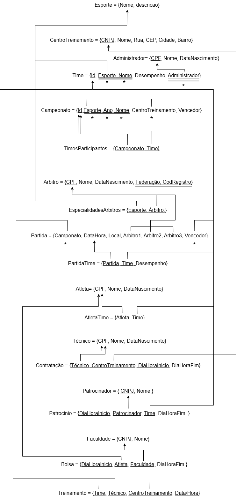

# Centro Treinamento

## Descrição do problema 

A aplicação será usada para administrar centros de treinamento. O foco será a criação de um espaço para a prática esportiva por uma variedade de atletas de diferentes níveis, desde amadores até profissionais. O desempenho dos atletas serão armazenados, a fim de que aqueles com o melhor performance possam ser ofertados com bolsas por entidades educacionais. O usuário alvo são instituições em âmbito nacional responsáveis pelo suporte a atletas promissores. O registro de treinos, acompanhamento de progresso e comparação de resultados entre atletas de vários centros de treinamento serão todos facilitados pelo sistema.

Dentre as funcionalidades que o sistema deve proporcionar estarão: a possibilidade de cadastrar novos centros de treinamento, consultar o histórico de desempenho dos atletas, registrar times e relacioná-los com o esporte praticado, organizar as competições e/ou entrar em competições já existentes. Além disso será permitido cadastrar diferentes pessoas como atletas, técnicos e árbitros para ajudar a gerir o centro de treinamento.

## Diagrama de ERM

## Diagrama Relacional

